# SparkSQL [Databricks]
## GitHub Repository Path
https://github.com/Andrey-Vospr/M13_Spark_Stream

## Table of Contents

1. [Prerequisites](#-prerequisites)  
2. [Deploy Azure Infrastructure](#-deploy-azure-infrastructure)  
   1. [Login & Terraform Backend Config](#1-login--terraform-backend-config)  
   2. [Initialize & Apply Terraform](#2-initialize--apply-terraform)  
3. [Upload Sample Data](#-upload-sample-data)  
4. [Configure Databricks Secrets](#-configure-databricks-secrets)  
5. [Solution Overview](#-solution-overview)  
6. [Notebook Walk-Through](#-notebook-walk-through)  
   1. [Imports & Schema Definition](#imports--schema-definition)  
   2. [Read Secrets & Spark Configuration](#read-secrets--spark-configuration)  
   3. [Path Setup & Sanity Checks](#path-setup--sanity-checks)  
   4. [Auto Loader (Bronze Stage)](#auto-loader-bronze-stage)  
   5. [Enrichment & Watermark (Silver Stage)](#enrichment--watermark-silver-stage)  
   6. [Aggregation (Gold Stage)](#aggregation-gold-stage)  
   7. [Streaming Queries & Checkpoints](#streaming-queries--checkpoints)  
   8. [Batch Read & Temporary View](#batch-read--temporary-view)  
   9. [Top‐10 Ranking & Visualization](#top-10-ranking--visualization)  
7. [Top‐10 Ranking & Visualization](#Top‐-10-Ranking-&-Visualization)  

## Prerequisites

- Azure CLI ([install docs](https://docs.microsoft.com/cli/azure))  
- Terraform 1.x ([install docs](https://www.terraform.io/downloads))  
- Databricks workspace & CLI configured ([setup guide](https://docs.databricks.com/dev-tools/cli/index.html))  
- Python 3.8+ with PySpark on Databricks

---

## Deploy Azure Infrastructure
### 1. Login & Terraform Backend Config

Authenticate with Azure and point Terraform at a remote state in your storage account:

```bash
wsl -d Ubuntu
az login
```

## 2. Initialize & Apply Terraform

```hcl
terraform {
  backend "azurerm" {
    resource_group_name  = "m13_sparkstreaming"
    storage_account_name = "m13sparkaccount" # Provide Storage Account name, where Terraform Remote state is stored
    container_name       = "result"
    key                  = "xxxxxx"
  }
}

```  
### Deploy Infrastructure with Terraform

Run the following Terraform commands:

```bash
terraform init
terraform plan -out terraform.plan
terraform apply terraform.plan
terraform output resource_group_name
az resource list --resource-group rg-dev-westeurope-dqch --output table
```

<p align="center">
  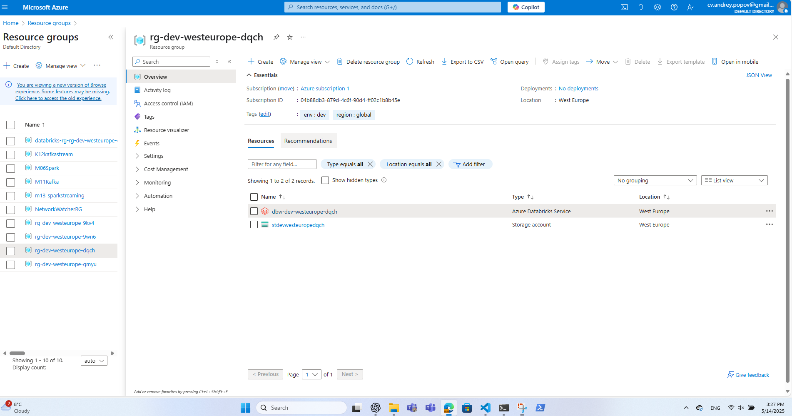
</p>


## 3. Upload Sample Data

<p align="center">
  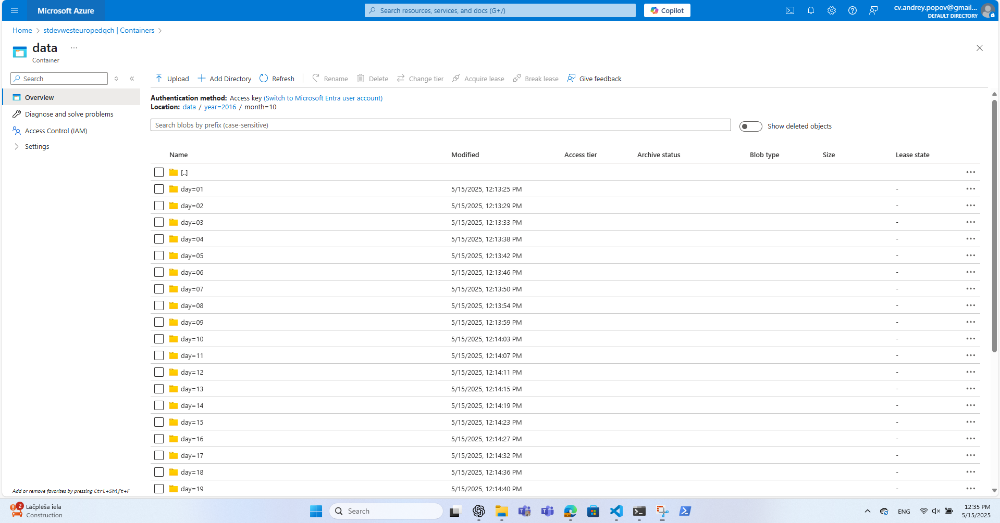
</p>

## 4. Configure Databricks Secrets

### Centralize all sensitive info and cluster config - file set_databricks.sh 

<p align="center">
  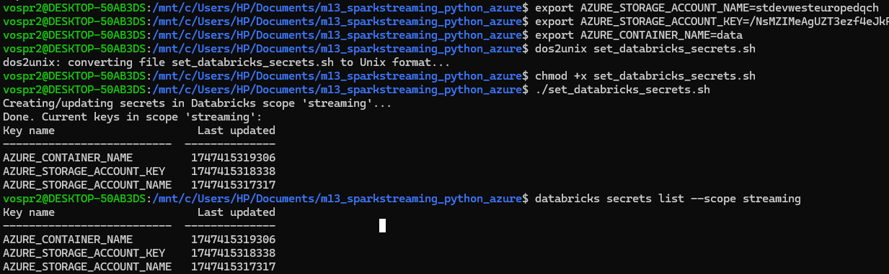
</p>


## 5. Solution Overview

1. **Bronze**: Auto Loader ingests new Parquet files.  
2. **Silver**: Casts `wthr_date` → `Timestamp`, extracts `date`, applies 1-day watermark.  
3. **Gold**: Groups by `city` & `date` → computes distinct hotel count and avg/max/min temperature.  
4. **Streaming Queries**:
   - **Console sink** for live debugging  
   - **Delta Lake sink** (complete mode) for persistent “gold” table  
5. **Batch Read**: Load the Delta table, register a temp view (`agg_view`).  
6. **Visualization**:  
   - Rank the top 10 cities by total Hotels  
   - For each city, display Hotels & Temperature metrics over 3 sample days


## Notebook Walk-Through
### 1) Imports & Schema Definition
#### Imports pull in exactly the Spark SQL functions we need. StructType and others define a schema for the incoming Parquet files so Auto Loader can enforce types.
```
    from pyspark.sql.functions import (
        year, month, dayofmonth, col, to_date,
        approx_count_distinct, avg, max, min, round, desc
    )
    from pyspark.sql.types import (
        StructType, StringType, DoubleType, TimestampType
    )
```

### 2) Read Secrets & Spark Configuration
#### Read Secrets & Configure Spark: reads the three pieces of sensitive info stored earlier

```
storage_account = dbutils.secrets.get("streaming", "AZURE_STORAGE_ACCOUNT_NAME")
storage_key     = dbutils.secrets.get("streaming", "AZURE_STORAGE_ACCOUNT_KEY")
container       = dbutils.secrets.get("streaming", "AZURE_CONTAINER_NAME")

# tell Spark how to authenticate Blob storage
spark.conf.set(
    f"fs.azure.account.key.{storage_account}.blob.core.windows.net",
    storage_key
)
```

### 3) Path Setup & Sanity Checks
#### Build Paths
```
container_root    = f"wasbs://{container}@{storage_account}.blob.core.windows.net/" # the WASBS URL to storage container’s “root.”
input_path        = container_root     # where Auto Loader will look for new files
checkpoint_prefix = "dbfs:/checkpoints/hotel-weather/" # DBFS paths (not WASBS) where each streaming query stores its state. DBFS -> RocksDB-based state stores work correctly
console_ckpt      = checkpoint_prefix + "console-hotel-weather-agg"
delta_ckpt        = checkpoint_prefix + "delta-agg-city"
delta_path        = container_root + "delta/agg_city" #where the aggregated results will be written as Delta files
```
#### Path Setup & Sanity Checks. Sanity-Check Your Paths: Listing the container root and input_path confirms that Spark can see your folders
```
print("Container root listing:")
display(dbutils.fs.ls(container_root))
print("Input path listing:")
display(dbutils.fs.ls(input_path))
```
<p align="center">
  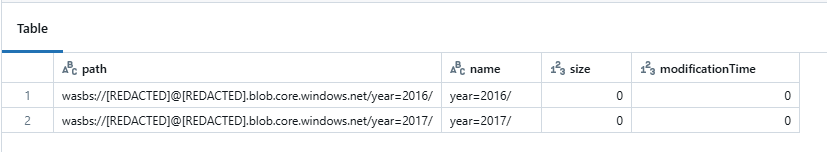
</p>

### 4) Auto Loader (Bronze Stage)
#### Define Schema & Start Auto Loader: 
```
schema = (
    StructType()
      .add("address",    StringType())
      .add("avg_tmpr_c", DoubleType())
      .add("avg_tmpr_f", DoubleType())
      .add("city",       StringType())
      .add("country",    StringType())
      .add("geoHash",    StringType())
      .add("id",         StringType())
      .add("latitude",   DoubleType())
      .add("longitude",  DoubleType())
      .add("name",       StringType())
      .add("wthr_date",  StringType())
      .add("wthr_year",  StringType())
      .add("wthr_month",  StringType())
      .add("wthr_day",  StringType())
)
```

### "Bronze stage" - streaming - load streaming data using Auto Loader
```
raw_stream = (
    spark.readStream
      .format("cloudFiles")
      .option("cloudFiles.format", "parquet")
      .option("header", "true")
      .schema(hotel_schema)
      .load(input_path)
)
```
#### Printing the schema ensures version drift 
```
print("Raw stream schema:")
raw_stream.printSchema()
display(raw_stream)
```
<p align="center">
  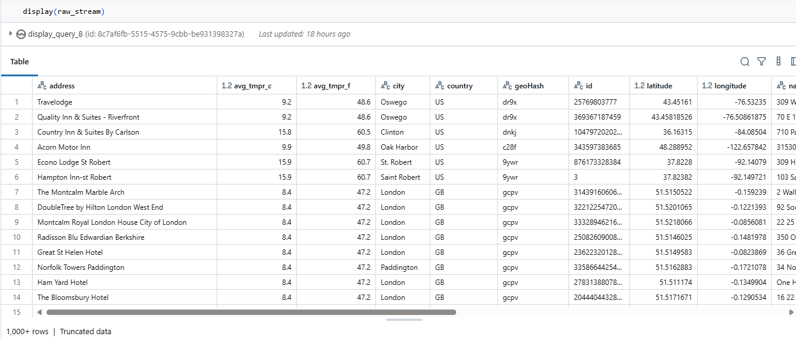
</p>


### 5) Enrichment & Watermark (Silver Stage)

### "Silver stage" - transformation: add year, month, and day columns for grouping. 
#### Enrich with Timestamp, Date & Watermark: Spark to drop state for event‐times older than 1 day, preventing unbounded state growth.
```
stream = (
    raw_stream
      .withColumn("wthr_date", col("wthr_date").cast(TimestampType()))
      .withColumn("date",      to_date(col("wthr_date")))
      .withWatermark("wthr_date", "1 day")  # handle up-to-1-day late data
)
display(stream)
```
<p align="center">
  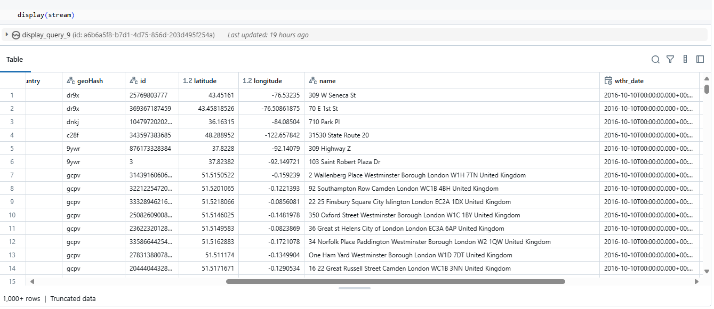
</p>

### 6) Aggregation (Gold Stage)

### "Gold stage" - aggregate data per city per day. 
#### Aggregations: unique hotel count plus average/max/min temperature, rounded to two decimals for readability
```
stream = (
    raw_stream
      .withColumn("wthr_date", col("wthr_date").cast(TimestampType()))
      .withColumn("date",      to_date(col("wthr_date")))
      .withWatermark("wthr_date", "1 day")
)
aggregated = (
    stream
      .groupBy("city", "date")
      .agg(
          approx_count_distinct("id") .alias("distinct_hotels"),
          round(avg("avg_tmpr_c"), 2) .alias("avg_temp_c"),
          round(max("avg_tmpr_c"), 2) .alias("max_temp_c"),
          round(min("avg_tmpr_c"), 2) .alias("min_temp_c")
      )
)
print("Aggregated schema:")
aggregated.printSchema()
display(aggregated)
```
<p align="center">
  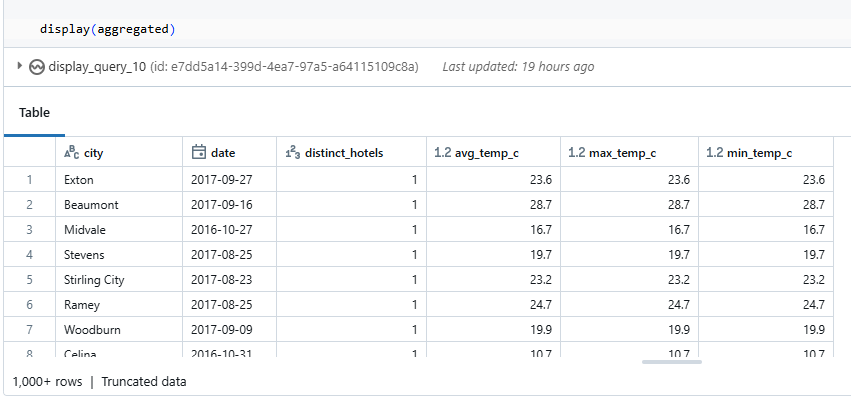
</p>

### 7) Streaming Queries & Checkpoints
#### Start Streaming Queries (separate checkpoints: isolates each query’s state so RocksDB files aren’t corrupted). Creates a “gold” table 
#### 7a) Console sink (for debug) - rapid feedback in the notebook UI
```
console_q = (
    aggregated.writeStream
      .outputMode("complete")
      .format("console")
      .option("truncate", False)
      .option("checkpointLocation", console_ckpt)
      .trigger(processingTime="20 seconds")
      .start()
)
display(console_q)
```
<p align="center">
  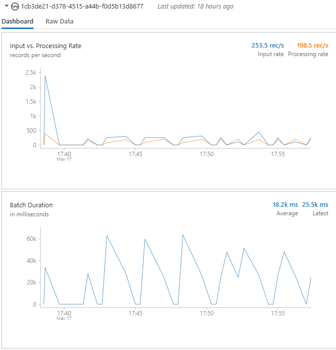
</p>

#### 7b) Delta Lake sink (get aggregated results into a Delta Lake folder, forming the “gold” table to visualize).
```
delta_q = (
    aggregated.writeStream
      .outputMode("complete")
      .format("delta")
      .option("path",               delta_path)
      .option("checkpointLocation", delta_ckpt) # Each query has its own fresh DBFS checkpoint folder to isolate state
      .trigger(processingTime="20 seconds")
      .start()
)
```
<p align="center">
  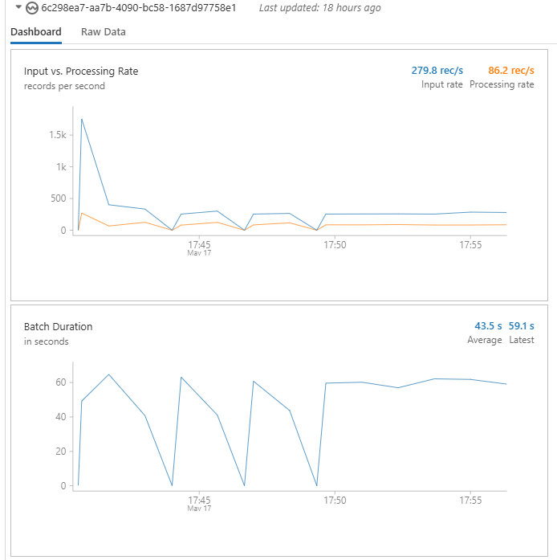
</p>

### 8) Batch Read & Temporary View
#### Read Back Delta & Register View
```
agg_batch_df = spark.read.format("delta").load(delta_path) # Once Delta has been populated by the streaming job, I can treat it as a normal, static table.
agg_batch_df.createOrReplaceTempView("agg_view") # Creating a temp view makes it easy to run Spark SQL for ranking and visualization.
```
### 9) Identify Top 10 Cities by Hotel Count. Aggregate across all dates to find which cities have the most total hotels in our data set
```
top10_df = spark.sql("""
  SELECT city, SUM(distinct_hotels) AS total_hotels
    FROM agg_view
   GROUP BY city
   ORDER BY total_hotels DESC
   LIMIT 10
""")
display(top10_df)
top_cities = [r["city"] for r in top10_df.collect()]
```
<p align="center">
  
</p>

## 7) Top‐10 Ranking & Visualization
#### - The aggregated data is read in batch mode, 
#### - Registered as a temporary SQL view, and queried to find the top 10 cities with the most distinct hotels and to retrieve detailed statistics for each city
#### - Get first 3 dates - restrict to 3 days for more convinient visualisation of results  
#### - Add visualization for each 10 cities.  

### Per-City Visualization

#### a) Fetch the full daily series for this city, select that city’s day-by-day metrics, 
```
for city in top_cities: 
    full = spark.sql(f"""
      SELECT date,
             distinct_hotels,
             avg_temp_c,
             max_temp_c,
             min_temp_c
        FROM agg_view
       WHERE city = '{city}'
       ORDER BY date
    """)
```

##### Get first 3 dates - restrict to 3 days for more convinient visualisation of results
```
    first3 = [r.date for r in full.select("date")
                          .orderBy("date")
                          .limit(3)
                          .collect()]
    
    small = full.where(col("date").isin(first3))
```

#### c) “Unpivot” the four metrics into (metric, value) pairs, to turn 4 separate columns into a single value column with a metric label—this allows plotting all four series in one chart.
```
    unpivot = small.selectExpr(
      "date",
      """
      stack(
        4,
        'Hotels',          cast(distinct_hotels as double),
        'Avg Temperature', avg_temp_c,
        'Max Temperature', max_temp_c,
        'Min Temperature', min_temp_c
      ) as (metric, value)
      """
    )
``` 
#### d) Print a big header with the city name
```
    displayHTML(f"<h2 style='margin-top:2em'>{city}</h2>")
```
#### e) Display the unpivoted table; then in the Visualization tab choose:
#####     • Chart type: Line (or Bar)
#####   • X-axis: date
#####   • Y-axis: value
#####   • Group by: metric
``` 
  display(unpivot)
``` 
#### All 10 cities presented in .html Notebook file

<p align="center">
  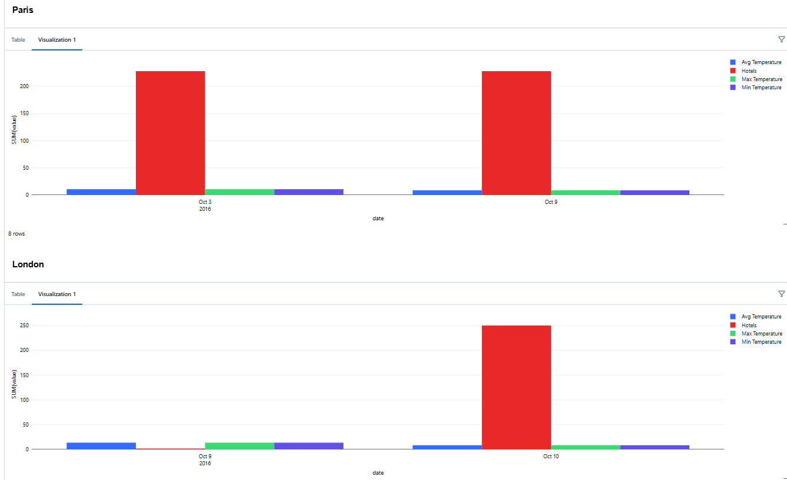
</p>
<p align="center">
  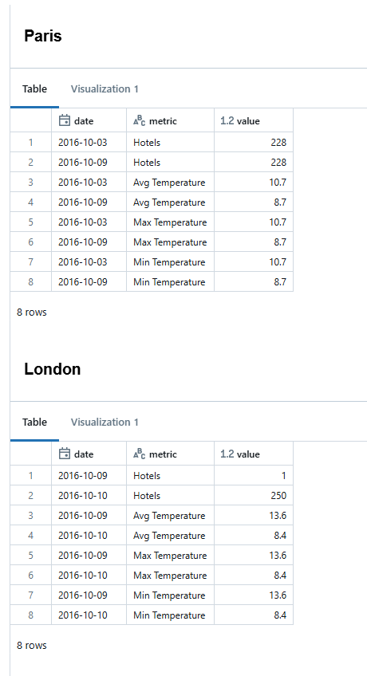
</p>

## Done!
